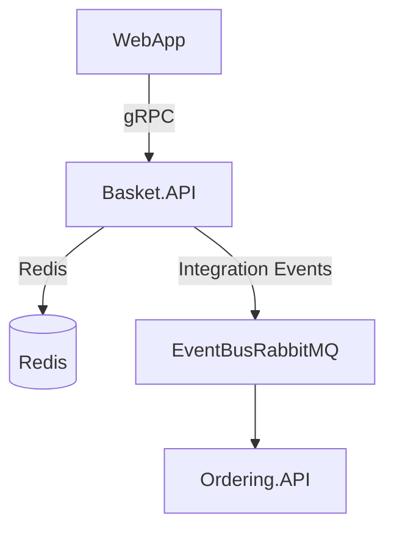

# Basket.API – eShop: Basket Service Architecture & Codebase Overview

## Summary
- Implements basket management for eShop (shopping cart operations).
- Built with ASP.NET Core, using gRPC for inter-service communication.
- Integrates with Redis for basket persistence.
- Publishes integration events for order processing.
- Follows event-driven and repository patterns.

## Projects & Folder Map
| Folder/File                | Purpose & Main Entry Points                  |
|---------------------------|----------------------------------------------|
| `Basket.API/Program.cs`   | Main entry; configures DI, endpoints, gRPC.  |
| `Basket.API/Grpc/`        | gRPC service implementation (`BasketService.cs`). |
| `Basket.API/Proto/`       | gRPC proto definition (`basket.proto`).      |
| `Basket.API/Model/`       | Basket domain models (`CustomerBasket.cs`).  |
| `Basket.API/Repositories/`| Basket repository abstraction/Redis impl.    |
| `Basket.API/IntegrationEvents/` | Event classes & handlers for order events. |
| `Basket.API/Extensions/`  | DI/service registration helpers.             |
| `Basket.API/appsettings*.json` | Configuration files.                      |

## Component Diagram


ASCII fallback:
WebApp --gRPC--> Basket.API --Redis--> Redis
Basket.API --Integration Events--> EventBusRabbitMQ --Events--> Ordering.API

## Communication Channels
- **gRPC Service:**
  - Proto: [`Basket.API/Proto/basket.proto`](Basket.API/Proto/basket.proto)
  - Service: [`Basket.API/Grpc/BasketService.cs`](Basket.API/Grpc/BasketService.cs)
- **Integration Events:**
  - Event: [`IntegrationEvents/Events/OrderStartedIntegrationEvent.cs`](Basket.API/IntegrationEvents/Events/OrderStartedIntegrationEvent.cs)
  - Handler: [`IntegrationEvents/EventHandling/OrderStartedIntegrationEventHandler.cs`](Basket.API/IntegrationEvents/EventHandling/OrderStartedIntegrationEventHandler.cs)
- **Redis:**
  - Repository: [`Repositories/RedisBasketRepository.cs`](Basket.API/Repositories/RedisBasketRepository.cs)

## Data Flow
### 1. Add Item to Basket
1. gRPC call to `AddItem` ([`BasketService.cs`](Basket.API/Grpc/BasketService.cs))
2. Repository updates basket in Redis ([`RedisBasketRepository.cs`](Basket.API/Repositories/RedisBasketRepository.cs))
3. Returns updated basket to caller

### 2. Place Order
1. gRPC call to `Checkout` ([`BasketService.cs`](Basket.API/Grpc/BasketService.cs))
2. Publishes `OrderStartedIntegrationEvent` ([`OrderStartedIntegrationEvent.cs`](Basket.API/IntegrationEvents/Events/OrderStartedIntegrationEvent.cs))
3. Event handled by downstream services ([`OrderStartedIntegrationEventHandler.cs`](Basket.API/IntegrationEvents/EventHandling/OrderStartedIntegrationEventHandler.cs))

## Dependency Registration & DI Wiring
- **DI Container:** ASP.NET Core built-in
- **Registration:**
  - [`Program.cs`](Basket.API/Program.cs):
    ```csharp
    builder.Services.AddGrpc();
    builder.Services.AddScoped<IBasketRepository, RedisBasketRepository>();
    // ...existing code...
    ```
  - [`Extensions/Extensions.cs`](Basket.API/Extensions/Extensions.cs):
    ```csharp
    public static IServiceCollection AddBasketServices(this IServiceCollection services) {
        services.AddScoped<IBasketRepository, RedisBasketRepository>();
        // ...existing code...
    }
    ```

## Configuration & Secrets
- **Sources:**
  - [`appsettings.json`](Basket.API/appsettings.json)
  - [`appsettings.Development.json`](Basket.API/appsettings.Development.json)
- **Keys:**
  - Redis connection string, event bus settings, etc.
- **Sensitive Data:**
  - Connection strings managed via config files; recommend using environment variables or secret managers for production.

## Persistence & Data Access
- **Database:** Redis (NoSQL, key-value)
- **Repository Pattern:**
  - Interface: [`IBasketRepository.cs`](Basket.API/Repositories/IBasketRepository.cs)
  - Implementation: [`RedisBasketRepository.cs`](Basket.API/Repositories/RedisBasketRepository.cs)
- **No EF Core migrations (Redis only)**

## Patterns & Architecture Notes
- **Repository Pattern:** Encapsulates basket data access.
- **Event-Driven:** Publishes integration events for order processing.
- **gRPC:** Used for service-to-service communication.
- **Minimal API:** Startup wiring in `Program.cs`.

## Security & Operational Considerations
- **Authentication/Authorization:**
  - Not directly visible; recommend securing gRPC endpoints and Redis access.
- **Observability:**
  - Logging and telemetry via ASP.NET Core defaults.
- **Deployment:**
  - No Dockerfile in this folder; likely orchestrated via AppHost or root manifests.
- **Risks:**
  - Ensure secrets are not hard-coded; use secure config for Redis/EventBus.

---
*This overview is based on the current codebase and folder structure. For further details, see referenced files and integration points.*
