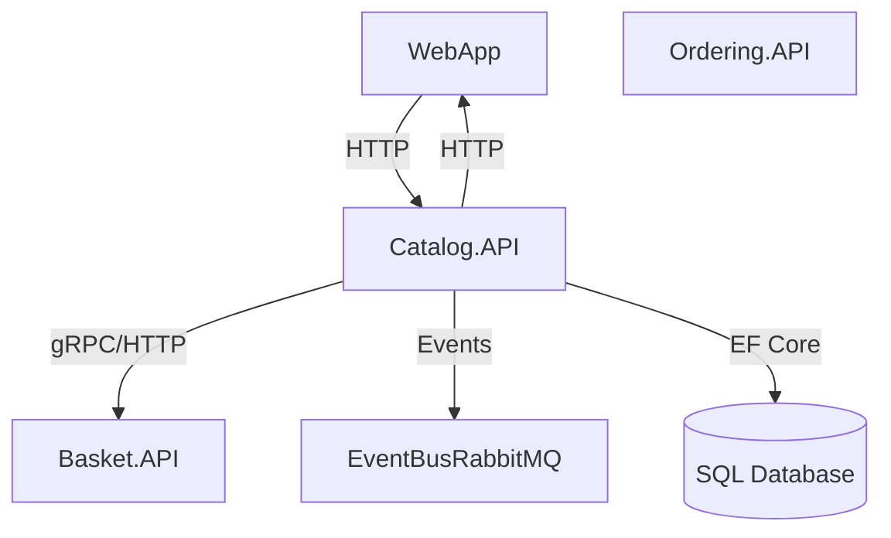

# eShop Catalog.API – Architecture & Codebase Overview

## Summary
- Catalog.API provides product catalog management for the eShop system.
- Built with ASP.NET Core, Entity Framework Core, and follows modern .NET microservice patterns.
- Exposes HTTP APIs for catalog operations; integrates with event-driven messaging for stock/order events.
- Uses SQL database via EF Core; supports migrations and seeding.
- Implements dependency injection, configuration via appsettings, and service defaults for distributed hosting.

## Projects & Folder Map
| Folder/File | Purpose & Main Entry |
|-------------|---------------------|
| `Program.cs` | Main entry, minimal API setup, DI/service registration |
| `Program.Testing.cs` | Test-specific startup wiring |
| `Apis/` | API surface, main endpoints in `CatalogApi.cs` |
| `Infrastructure/` | Data access, EF Core context, migrations, entity configs |
| `IntegrationEvents/` | Event publishing/handling for catalog-related events |
| `Model/` | Domain models: `CatalogItem`, `CatalogBrand`, etc. |
| `Services/` | Business logic, e.g., AI-based catalog features |
| `Setup/` | Static config files |
| `appsettings*.json` | Configuration sources |

## Component Diagram


ASCII fallback:

    [WebApp] <--> [Catalog.API] <--> [SQL DB]
        |                |
    [Basket.API]      [EventBusRabbitMQ]

## Communication Channels
- **HTTP Endpoints:**
  - Defined in `Apis/CatalogApi.cs` (minimal API style)
  - Example: `GET /api/catalog/items`, `POST /api/catalog/items`
- **gRPC:**
  - No direct proto files in Catalog.API, but may interact with gRPC via other services.
- **Event Bus (RabbitMQ):**
  - Publishes integration events (e.g., `ProductPriceChangedIntegrationEvent`) via `IntegrationEvents/Events/` and handled in `IntegrationEvents/EventHandling/`.
- **Configuration:**
  - Endpoints, connection strings in `appsettings.json` and `appsettings.Development.json`

## Data Flow
### 1. Add Item to Catalog
1. HTTP POST `/api/catalog/items` (`Apis/CatalogApi.cs`)
2. Validates and creates `CatalogItem` (`Model/CatalogItem.cs`)
3. Persists via `CatalogContext` (`Infrastructure/CatalogContext.cs`)
4. Publishes event if needed (`IntegrationEvents/CatalogIntegrationEventService.cs`)

### 2. Confirm Order Stock
1. Order placed in `Ordering.API` triggers stock check event
2. Catalog.API receives event (`IntegrationEvents/EventHandling/OrderStatusChangedToAwaitingValidationIntegrationEventHandler.cs`)
3. Checks stock via `CatalogContext`
4. Publishes confirmation/rejection event (`IntegrationEvents/Events/OrderStockConfirmedIntegrationEvent.cs`)

## Dependency Registration & DI Wiring
- DI container: ASP.NET Core built-in
- Registration in `Program.cs`:
  ```csharp
  builder.Services.AddDbContext<CatalogContext>(...);
  builder.Services.AddScoped<ICatalogIntegrationEventService, CatalogIntegrationEventService>();
  builder.Services.AddTransient<ICatalogAI, CatalogAI>();
  // ...existing code...
  ```
- ServiceDefaults via `eShop.ServiceDefaults` package
- Extension methods in `Extensions/Extensions.cs`

## Configuration & Secrets
- Sources: `appsettings.json`, `appsettings.Development.json`
- Keys: `ConnectionStrings:CatalogConnection`, event bus settings, feature flags
- No hard-coded secrets; sensitive info via environment or user secrets
- Example:
  ```json
  "ConnectionStrings": {
    "CatalogConnection": "Server=...;Database=...;User Id=...;Password=...;"
  }
  ```

## Persistence & Data Access
- Database: SQL (likely SQL Server)
- ORM: Entity Framework Core
- Context: `Infrastructure/CatalogContext.cs`
- Migrations: `Infrastructure/Migrations/`
- Entity configs: `Infrastructure/EntityConfigurations/`
- Seeding: `Infrastructure/CatalogContextSeed.cs`

## Patterns & Architecture Notes
- Patterns: Repository (via EF Core), Event-driven (IntegrationEvents), Minimal API
- Event classes: `IntegrationEvents/Events/`
- Event handlers: `IntegrationEvents/EventHandling/`
- DI via constructor injection
- Separation of concerns: Models, Services, Infrastructure

## Security & Operational Considerations
- Authentication/Authorization: Not explicit in Catalog.API, likely handled upstream (WebApp, API Gateway)
- CORS: Configurable via service defaults
- Observability: Logging, metrics, health checks via ServiceDefaults
- Deployment: No Dockerfile in Catalog.API, but likely orchestrated via AppHost
- Risks: Ensure secrets are not hard-coded; validate CORS and auth settings

---

*This overview is based on the current workspace files. For deeper details, see referenced files and folders.*
