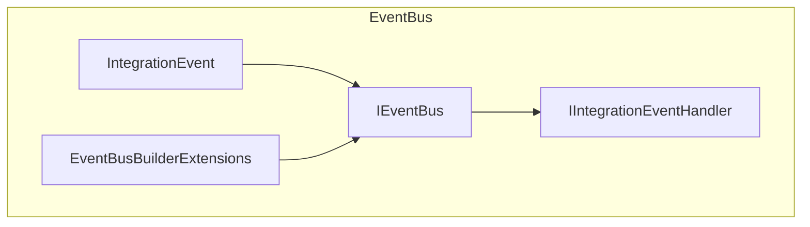

# EventBus: Architecture & Codebase Overview

## Title
**EventBus** – Shared eventing abstraction for distributed messaging in eShop.

## Summary
- Provides core abstractions and base types for event-driven communication across eShop microservices.
- Defines integration event contracts, event bus interfaces, and subscription management.
- Used by other services (e.g., Basket, Ordering, Catalog) for publishing and handling integration events.
- Implements extensible builder and DI registration patterns for event bus setup.
- No direct persistence or external dependencies; focuses on contracts and extensibility.

## Projects & Folder Map
| Folder/File                | Purpose & Main Entry Files |
|---------------------------|---------------------------|
| `EventBus.csproj`         | Project file; class library for eventing abstractions |
| `Abstractions/`           | Core interfaces: `IEventBus`, `IIntegrationEventHandler`, `IEventBusBuilder`, `EventBusSubscriptionInfo` |
| `Events/IntegrationEvent.cs` | Base class for integration events |
| `Extensions/`             | DI and builder extensions: `EventBusBuilderExtensions`, `GenericTypeExtensions` |
| `GlobalUsings.cs`         | Project-wide global usings |

## Component Diagram


ASCII fallback:

    +-------------------+
    |   EventBus        |
    |-------------------|
    | IntegrationEvent  |
    | IEventBus         |
    | IIntegrationEventHandler |
    | EventBusBuilderExtensions|
    +-------------------+

## Communication Channels
- **Message/Event Contracts:**
  - Integration events defined in `Events/IntegrationEvent.cs`:
    ```csharp
    // src/EventBus/Events/IntegrationEvent.cs
    public abstract class IntegrationEvent {
        public Guid Id { get; }
        public DateTime CreationDate { get; }
        // ...
    }
    ```
- **Event Bus Interface:**
  - `IEventBus` in `Abstractions/IEventBus.cs`:
    ```csharp
    public interface IEventBus {
        void Publish(IntegrationEvent @event);
        void Subscribe<T, TH>() where T : IntegrationEvent where TH : IIntegrationEventHandler<T>;
        // ...
    }
    ```
- **No direct HTTP/gRPC endpoints or message broker wiring in this project.**

## Data Flow
### 1. Publish Integration Event
1. Service creates an event (e.g., `OrderCreatedIntegrationEvent` inheriting from `IntegrationEvent`).
2. Calls `IEventBus.Publish(event)`.
3. EventBus implementation (in another project) dispatches to message broker.
   - Relevant files: `Abstractions/IEventBus.cs`, `Events/IntegrationEvent.cs`

### 2. Subscribe & Handle Event
1. Service registers handler via `IEventBus.Subscribe<T, TH>()`.
2. Handler implements `IIntegrationEventHandler<T>`.
3. On event receipt, EventBus invokes handler.
   - Relevant files: `Abstractions/IIntegrationEventHandler.cs`, `Abstractions/IEventBus.cs`

## Dependency Registration and DI Wiring
- **Builder Extensions:**
  - `Extensions/EventBusBuilderExtensions.cs` provides extension methods for DI registration:
    ```csharp
    public static IEventBusBuilder AddEventBus(this IServiceCollection services) {
        // ...
    }
    ```
- **DI Container:**
  - Uses standard .NET `IServiceCollection` for registration.
- **Example Registration:**
    ```csharp
    // src/EventBus/Extensions/EventBusBuilderExtensions.cs
    services.AddSingleton<IEventBus, EventBusImplementation>();
    ```

## Configuration and Secrets
- **No direct configuration or secrets in this project.**
- Consumed by other services that configure event bus implementations and connection strings.

## Persistence & Data Access
- **No database or ORM usage in this project.**
- Purely contracts and abstractions for eventing.

## Patterns & Architecture Notes
- **Event-driven architecture:**
  - Defines base event and handler contracts for distributed messaging.
- **Builder/Extension pattern:**
  - DI registration via extension methods.
- **Abstraction/Interface segregation:**
  - All event bus operations via interfaces for pluggable implementations.

## Security & Operational Considerations
- **No authentication/authorization in this project.**
- No hard-coded secrets or sensitive config.
- **Operational:**
  - Used as a shared library; deployment managed by consuming services.
- **Observability:**
  - No direct logging/metrics; expected to be implemented by event bus providers.

---

> This overview documents the architecture and codebase of the `EventBus` shared library in eShop. For implementation details, see consuming projects (e.g., `Basket.API`, `Ordering.API`, `EventBusRabbitMQ`).
