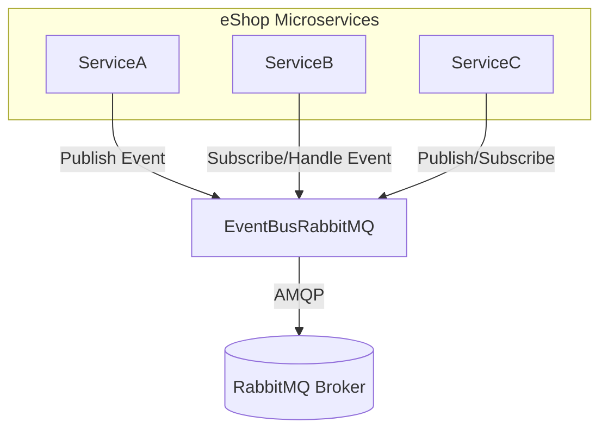

# EventBusRabbitMQ: Architecture & Codebase Overview

## Title
**EventBusRabbitMQ** – RabbitMQ-based event bus for distributed messaging in eShop.

## Summary
- Implements a RabbitMQ-backed event bus for publish/subscribe messaging.
- Enables decoupled communication between microservices in the eShop solution.
- Provides DI extensions for easy integration into .NET services.
- Core technologies: .NET, RabbitMQ.Client, event-driven architecture.
- Key files: `RabbitMQEventBus.cs`, `RabbitMqDependencyInjectionExtensions.cs`, `EventBusOptions.cs`.

## Projects & Folder Map
| Folder/File                          | Purpose & Main Entry Files                  |
|--------------------------------------|---------------------------------------------|
| `EventBusRabbitMQ/`                  | RabbitMQ event bus implementation           |
| ├─ `RabbitMQEventBus.cs`             | Main event bus logic (publish/subscribe)    |
| ├─ `RabbitMqDependencyInjectionExtensions.cs` | DI/service registration helpers      |
| ├─ `EventBusOptions.cs`              | Configuration options for RabbitMQ          |
| ├─ `RabbitMQTelemetry.cs`            | Telemetry integration (logging/metrics)     |
| ├─ `EventBusRabbitMQ.csproj`         | Project file, dependencies                  |
| ├─ `GlobalUsings.cs`                 | Global using directives                     |

## Component Diagram


ASCII fallback:

    [ServiceA]--(publish)-->[EventBusRabbitMQ]--AMQP-->[RabbitMQ]
    [ServiceB]--(subscribe)-->[EventBusRabbitMQ]--AMQP-->[RabbitMQ]
    [ServiceC]--(publish/subscribe)-->[EventBusRabbitMQ]--AMQP-->[RabbitMQ]

## Communication Channels
- **Message Broker:**
  - RabbitMQ (AMQP protocol)
  - Exchanges, queues configured via `EventBusOptions.cs`
- **DI Registration:**
  - Extension methods in `RabbitMqDependencyInjectionExtensions.cs`
- **No direct HTTP/gRPC endpoints in this library.**

## Data Flow
### 1. Publish Event
1. Service calls `RabbitMQEventBus.Publish(event)` (`RabbitMQEventBus.cs`).
2. Event serialized and sent to RabbitMQ exchange.
3. Other services subscribed to the event receive it via RabbitMQ queue.

### 2. Subscribe/Handle Event
1. Service registers event handler via DI (`RabbitMqDependencyInjectionExtensions.cs`).
2. `RabbitMQEventBus` listens for events from RabbitMQ queue.
3. On event received, invokes registered handler.

## Dependency Registration & DI Wiring
- DI extensions in `RabbitMqDependencyInjectionExtensions.cs`:
```csharp
public static IServiceCollection AddRabbitMQEventBus(this IServiceCollection services, Action<EventBusOptions> configure)
{
    services.Configure(configure);
    services.AddSingleton<IEventBus, RabbitMQEventBus>();
    // ...existing code...
}
```
- Typical usage in consuming service:
```csharp
builder.Services.AddRabbitMQEventBus(options =>
{
    options.HostName = "localhost";
    options.UserName = "guest";
    options.Password = "guest";
});
```

## Configuration & Secrets
- Configuration via `EventBusOptions.cs`:
  - HostName, UserName, Password, ExchangeName, QueueName, etc.
- Consuming services typically set these in their `appsettings.json` or via environment variables.
- No direct secret storage in this project; sensitive values should be managed by consuming service (e.g., Key Vault, UserSecrets).

## Persistence & Data Access
- No direct database or ORM usage in this project.
- All persistence is handled by RabbitMQ (external broker).

## Patterns & Architecture Notes
- **Event-driven architecture:** decouples producers/consumers via events.
- **Dependency Injection:** DI extensions for easy integration.
- **Options pattern:** for configuration (`EventBusOptions.cs`).
- **Telemetry integration:** via `RabbitMQTelemetry.cs`.

## Security & Operational Considerations
- **Authentication:** RabbitMQ credentials (UserName/Password) set via options.
- **Risks:**
  - Hard-coded credentials in consuming services (should use secrets management).
  - Broker connectivity and message durability depend on RabbitMQ setup.
- **Observability:**
  - Telemetry hooks in `RabbitMQTelemetry.cs` for logging/metrics.
- **Deployment:**
  - No Dockerfile/manifest in this project; consuming services must configure RabbitMQ connectivity.

---

*This overview documents the architecture and integration points for the EventBusRabbitMQ project. For full solution context, see the main eShop repo overview.*
