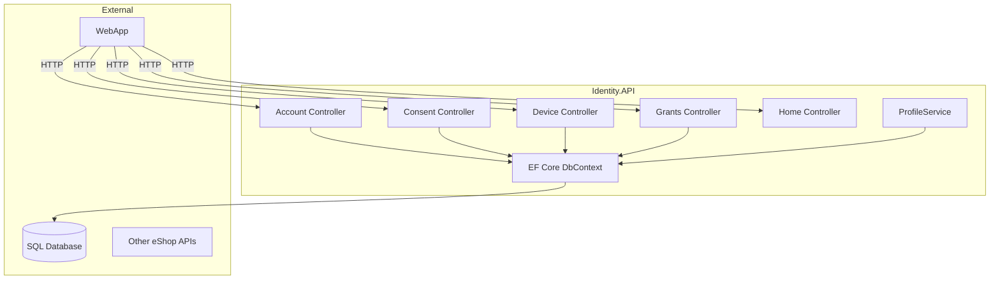

# Identity.API Project Overview

## Title
**eShop Identity.API** – Centralized authentication and user management for the eShop distributed system.

## Summary
- Provides authentication, authorization, and user profile management for eShop services.
- Implements ASP.NET Core Identity and OpenID Connect flows.
- Integrates with Entity Framework Core for persistence.
- Exposes HTTP endpoints for account, consent, device, and grant management.
- Supports extensible login and profile services for federated identity providers.

## Projects & Folder Map
| Folder/File | Purpose |
|-------------|---------|
| `Program.cs` | Main entry point, service registration, middleware setup |
| `Data/` | EF Core DbContext and migrations |
| `Models/` | Domain models and view models for identity flows |
| `Quickstart/` | Controllers and helpers for account, consent, device, diagnostics, grants, home |
| `Services/` | Login/profile/redirect service abstractions and implementations |
| `Views/` | Razor views for UI flows |
| `wwwroot/` | Static assets |
| `appsettings*.json` | Configuration files |
| `Identity.API.csproj` | Project file |

## Component Diagram


ASCII fallback:
```
+-------------------+      +-------------------+
|   Identity.API    |<---->|   SQL Database    |
|-------------------|      +-------------------+
| Account Controller|      |                   |
| Consent Controller|      +-------------------+
| Device Controller |<---->|   WebApp/OtherAPI |
| Grants Controller |      +-------------------+
| Home Controller   |
| ProfileService    |
+-------------------+
```

## Communication Channels
- **HTTP Endpoints** (MVC/Razor):
  - `/Account/*` – login, register, logout, external login
  - `/Consent/*` – consent management
  - `/Device/*` – device authorization
  - `/Grants/*` – grant management
  - `/Home/*` – home/info
  - Controllers: `Quickstart/Account/AccountController.cs`, `Quickstart/Consent/ConsentController.cs`, etc.
- **No gRPC endpoints**
- **No direct message broker integration**

## Data Flow
### 1. User Login
1. User navigates to `/Account/Login` (`Quickstart/Account/AccountController.cs`)
2. Login form posts credentials to `Login` action
3. Credentials validated via `EFLoginService` (`Services/EFLoginService.cs`)
4. On success, user principal created and authentication cookie issued
5. Redirect to requested resource or home

### 2. User Registration
1. User navigates to `/Account/Register` (`Quickstart/Account/AccountController.cs`)
2. Registration form posts data to `Register` action
3. User created in `ApplicationDbContext` (`Data/ApplicationDbContext.cs`)
4. Confirmation email sent (if configured)
5. Redirect to login or confirmation page

## Dependency Registration and DI Wiring
- DI container: ASP.NET Core built-in
- Registration in `Program.cs`:
  ```csharp
  builder.Services.AddDbContext<ApplicationDbContext>(...);
  builder.Services.AddIdentity<ApplicationUser, IdentityRole>(...);
  builder.Services.AddScoped<ILoginService, EFLoginService>();
  builder.Services.AddScoped<IProfileService, ProfileService>();
  // ...existing code...
  ```
- Transient/scoped/singleton examples:
  - `AddScoped<ILoginService, EFLoginService>()`
  - `AddScoped<IProfileService, ProfileService>()`

## Configuration and Secrets
- Sources:
  - `appsettings.json`, `appsettings.Development.json`
  - Environment variables
  - `tempkey.jwk` for signing keys
- Sensitive keys:
  - Connection strings: `ConnectionStrings:DefaultConnection`
  - Identity options, external provider secrets (if configured)
- No explicit use of UserSecrets or Key Vault detected

## Persistence & Data Access
- Database: SQL (via EF Core)
- ORM: Entity Framework Core
- DbContext: `Data/ApplicationDbContext.cs`
- Migrations: `Data/Migrations/`
- User model: `Models/ApplicationUser.cs`

## Patterns & Architecture Notes
- Patterns:
  - Repository (via EF Core DbContext)
  - Service abstraction for login/profile/redirect
  - MVC (controllers/views)
  - Event-driven (via Identity events, not external bus)
- Example:
  ```csharp
  public class EFLoginService : ILoginService { ... }
  // ...existing code...
  ```

## Security & Operational Considerations
- Authentication: ASP.NET Core Identity, OpenID Connect
- Authorization: Role-based, claims-based
- Risks:
  - Ensure secrets (keys, connection strings) are not hard-coded
  - Review CORS and cookie settings for security
- Observability:
  - Logging via ASP.NET Core built-in
  - No explicit health checks detected
- Deployment:
  - No Dockerfile or manifest in this folder
  - Standard ASP.NET Core deployment supported

---

*This overview provides a concise, actionable summary of the Identity.API project for maintainers and integrators. For further details, see referenced files and folders.*
