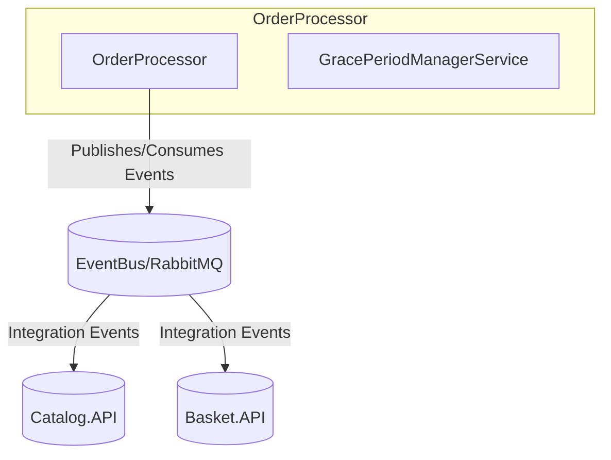

# eShop: OrderProcessor Project Architecture & Codebase Report

## Title
**OrderProcessor** – Background order management and event-driven processing for eShop.

## Summary
- Handles background order processing tasks, such as grace period management.
- Integrates with eShop's event-driven architecture (RabbitMQ/EventBus).
- Uses .NET Aspire, dependency injection, and configuration via appsettings.
- Communicates with other services via integration events.
- Implements background services for time-based order logic.

## Projects & Folder Map
| Folder/File | Purpose |
|-------------|---------|
| `OrderProcessor.csproj` | Project file, dependencies, build config |
| `Program.cs` | Main entry, DI setup, service registration |
| `BackgroundTaskOptions.cs` | Options for background task timing/configuration |
| `Events/GracePeriodConfirmedIntegrationEvent.cs` | Integration event definition |
| `Extensions/Extensions.cs` | Extension methods for DI/configuration |
| `Services/GracePeriodManagerService.cs` | Background service for grace period logic |
| `appsettings.json` / `appsettings.Development.json` | Configuration sources |

## Component Diagram


**ASCII fallback:**
OrderProcessor --> EventBus/RabbitMQ --> Catalog.API, Basket.API

## Communication Channels
- **Message Broker:**
  - Publishes/consumes integration events via EventBus/RabbitMQ
  - Example event: `GracePeriodConfirmedIntegrationEvent` (`Events/GracePeriodConfirmedIntegrationEvent.cs`)
- **No direct HTTP/gRPC endpoints** (background service only)

## Data Flow
### 1. Grace Period Confirmation
1. `GracePeriodManagerService` triggers after grace period (see `Services/GracePeriodManagerService.cs`).
2. Publishes `GracePeriodConfirmedIntegrationEvent` to EventBus (`Events/GracePeriodConfirmedIntegrationEvent.cs`).
3. Other services (e.g., Ordering.API) consume event and update order status.

### 2. Background Task Configuration
1. Reads timing/options from `appsettings.json` (`BackgroundTaskOptions`).
2. Registers background service in DI (`Program.cs`).
3. Service runs periodic checks and triggers events as needed.

## Dependency Registration and DI Wiring
- **DI Container:** Microsoft.Extensions.DependencyInjection
- **Registration Location:** `Program.cs`, `Extensions/Extensions.cs`
- **Example:**
```csharp
// Program.cs
builder.Services.AddHostedService<GracePeriodManagerService>();
builder.Services.Configure<BackgroundTaskOptions>(builder.Configuration.GetSection("BackgroundTaskOptions"));
```
- **Extension Methods:**
  - Custom DI/configuration extensions in `Extensions/Extensions.cs`

## Configuration and Secrets
- **Sources:**
  - `appsettings.json`, `appsettings.Development.json`
  - Environment variables (standard .NET config)
- **Keys:**
  - `BackgroundTaskOptions` (timing, intervals)
- **No hard-coded secrets or cloud SDKs detected.**

## Persistence & Data Access
- **No direct database integration in OrderProcessor.**
- Relies on event-driven updates; persistence handled by other services (e.g., Ordering.API).

## Patterns & Architecture Notes
- **Event-driven architecture:** Publishes integration events for cross-service communication.
- **Background service pattern:** Uses `IHostedService` for time-based logic.
- **Options pattern:** Configures background task options via strongly-typed POCO (`BackgroundTaskOptions.cs`).
- **Extension methods:** For DI/configuration setup (`Extensions/Extensions.cs`).

## Security & Operational Considerations
- **Authentication/Authorization:** Not directly implemented (background service only).
- **Observability:**
  - Logging via standard .NET logging (see `Program.cs`).
  - No explicit health checks, but can be added via Aspire/ServiceDefaults.
- **Deployment:**
  - No Dockerfile or manifest in this folder; likely orchestrated via eShop.AppHost.
  - Configuration via appsettings/environment.

---
**References:**
- [OrderProcessor.csproj](OrderProcessor.csproj)
- [Program.cs](Program.cs)
- [Services/GracePeriodManagerService.cs](Services/GracePeriodManagerService.cs)
- [Events/GracePeriodConfirmedIntegrationEvent.cs](Events/GracePeriodConfirmedIntegrationEvent.cs)
- [BackgroundTaskOptions.cs](BackgroundTaskOptions.cs)
- [Extensions/Extensions.cs](Extensions/Extensions.cs)
- [appsettings.json](appsettings.json)

---
*This report follows the Requirements Workflow conventions and is based solely on repository files.*
