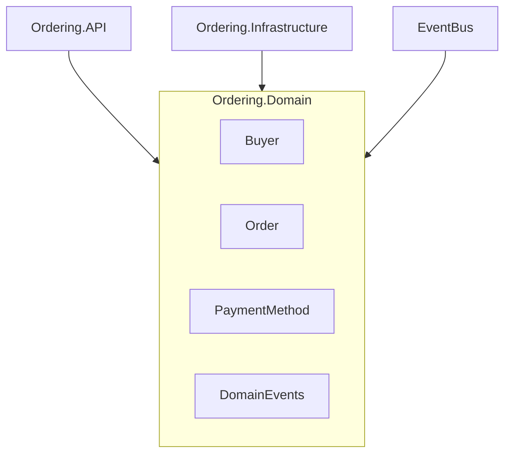

# eShop Ordering.Domain – Domain Model for Order Processing

## Summary
- Implements core domain logic for order management in eShop (DDD style)
- Primary technologies: .NET, C#, Domain-Driven Design (DDD)
- Contains aggregates, value objects, domain events, and repository interfaces
- No direct persistence or API surface; consumed by infrastructure and API layers
- Key patterns: Aggregate Root, Value Object, Domain Event, Repository

## Projects & Folder Map
| Folder/File | Purpose |
|-------------|--------|
| `AggregatesModel/BuyerAggregate/` | Buyer entity, payment methods, repository interface |
| `AggregatesModel/OrderAggregate/` | Order entity, items, address, status, repository interface |
| `Events/` | Domain events for order lifecycle (started, shipped, cancelled, etc.) |
| `Exceptions/` | Custom domain exception types |
| `SeedWork/` | Base types for DDD (Entity, ValueObject, IRepository, IUnitOfWork) |
| `Ordering.Domain.csproj` | Project file, references, build config |
| `GlobalUsings.cs` | Global using directives |

## Component Diagram


ASCII fallback:
Ordering.API --> [Ordering.Domain] <-- Ordering.Infrastructure
                      ^
                  [EventBus]

## Communication Channels
- No direct HTTP/gRPC endpoints or message brokers in this project
- Domain events (e.g., `OrderStartedDomainEvent`) are published to infrastructure/event bus
- Example event:
  ```csharp
  // Events/OrderStartedDomainEvent.cs
  public class OrderStartedDomainEvent : INotification {
      public Order Order { get; }
      // ...
  }
  ```

## Data Flow
### 1. Place Order
1. API receives order request (`Ordering.API`)
2. Creates `Order` aggregate (`AggregatesModel/OrderAggregate/Order.cs`)
3. Triggers domain event (`Events/OrderStartedDomainEvent.cs`)
4. Event handled by infrastructure/event bus

### 2. Add Payment Method
1. API receives payment method request (`Ordering.API`)
2. Loads `Buyer` aggregate (`AggregatesModel/BuyerAggregate/Buyer.cs`)
3. Adds payment method (`PaymentMethod.cs`)
4. Triggers domain event (`BuyerPaymentMethodVerifiedDomainEvent.cs`)

## Dependency Registration and DI Wiring
- No DI/service registration in this project (pure domain)
- Repository interfaces defined for implementation in infrastructure:
  ```csharp
  // AggregatesModel/OrderAggregate/IOrderRepository.cs
  public interface IOrderRepository : IRepository<Order> {
      // ...
  }
  ```

## Configuration and Secrets
- No configuration or secrets in this project
- Consumed by API/infrastructure layers which provide config (see their `appsettings.json`)

## Persistence & Data Access
- Defines repository interfaces (`IBuyerRepository`, `IOrderRepository`)
- No direct database/ORM code
- Persistence implemented in infrastructure layer
- Example:
  ```csharp
  // AggregatesModel/BuyerAggregate/IBuyerRepository.cs
  public interface IBuyerRepository : IRepository<Buyer> {
      // ...
  }
  ```

## Patterns & Architecture Notes
- Domain-Driven Design (DDD): Aggregates, Value Objects, Domain Events
- Repository pattern: interfaces only
- Event-driven: domain events for state changes
- Example Value Object:
  ```csharp
  // SeedWork/ValueObject.cs
  public abstract class ValueObject {
      // ...
  }
  ```

## Security & Operational Considerations
- No authentication/authorization logic in domain layer
- No hard-coded secrets or config
- No logging/metrics/health checks
- Deployment handled by API/infrastructure layers

---
This project is a pure domain model library for order processing in eShop, designed for use by API and infrastructure layers. All persistence, communication, and configuration are handled externally.
