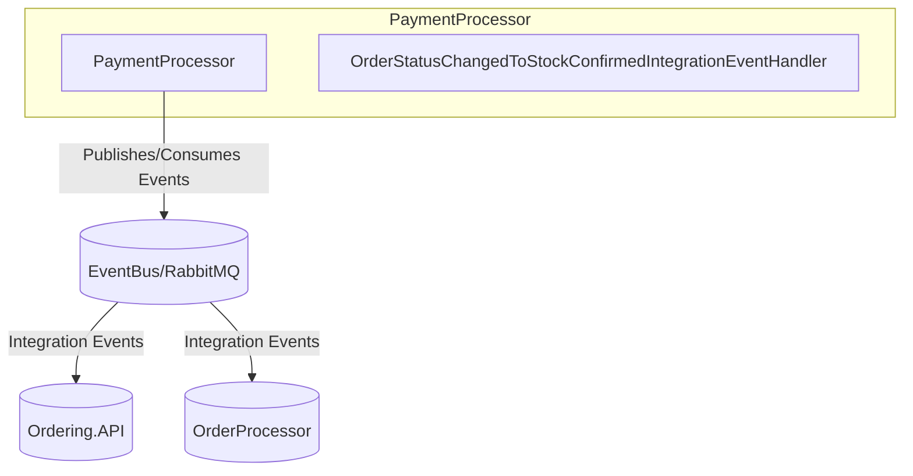

# eShop: PaymentProcessor Project Architecture & Codebase Report

## Title
**PaymentProcessor** – Event-driven payment status management for eShop orders.

## Summary
- Handles payment processing logic and reacts to order status changes.
- Publishes and consumes integration events for payment success/failure.
- Uses .NET Aspire, dependency injection, and configuration via appsettings.
- Integrates with EventBus/RabbitMQ for messaging.
- Implements event handlers for order/payment events.

## Projects & Folder Map
| Folder/File | Purpose |
|-------------|---------|
| `PaymentProcessor.csproj` | Project file, dependencies, build config |
| `Program.cs` | Main entry, DI setup, service registration |
| `PaymentOptions.cs` | Options for payment configuration |
| `IntegrationEvents/` | Event handlers for integration events |
| `IntegrationEvents/EventHandling/OrderStatusChangedToStockConfirmedIntegrationEventHandler.cs` | Handles order status change events |
| `IntegrationEvents/Events/` | Event definitions for payment and order status |
| `GlobalUsings.cs` | Global using directives |
| `appsettings.json` / `appsettings.Development.json` | Configuration sources |

## Component Diagram


**ASCII fallback:**
PaymentProcessor --> EventBus/RabbitMQ --> Ordering.API, OrderProcessor

## Communication Channels
- **Message Broker:**
  - Publishes/consumes integration events via EventBus/RabbitMQ
  - Example events:
    - `OrderPaymentSucceededIntegrationEvent` (`IntegrationEvents/Events/OrderPaymentSucceededIntegrationEvent.cs`)
    - `OrderPaymentFailedIntegrationEvent` (`IntegrationEvents/Events/OrderPaymentFailedIntegrationEvent.cs`)
    - `OrderStatusChangedToStockConfirmedIntegrationEvent` (`IntegrationEvents/Events/OrderStatusChangedToStockConfirmedIntegrationEvent.cs`)
- **No direct HTTP/gRPC endpoints** (event-driven only)

## Data Flow
### 1. Order Status Change to Stock Confirmed
1. `OrderStatusChangedToStockConfirmedIntegrationEventHandler` receives event (`IntegrationEvents/EventHandling/OrderStatusChangedToStockConfirmedIntegrationEventHandler.cs`).
2. Processes payment logic (success/failure).
3. Publishes `OrderPaymentSucceededIntegrationEvent` or `OrderPaymentFailedIntegrationEvent` to EventBus.
4. Other services (e.g., Ordering.API) consume payment result events.

### 2. Payment Event Publishing
1. Reads payment options from `appsettings.json` (`PaymentOptions.cs`).
2. Registers event handlers in DI (`Program.cs`).
3. Publishes payment result events based on business logic.

## Dependency Registration and DI Wiring
- **DI Container:** Microsoft.Extensions.DependencyInjection
- **Registration Location:** `Program.cs`
- **Example:**
```csharp
// Program.cs
builder.Services.AddTransient<OrderStatusChangedToStockConfirmedIntegrationEventHandler>();
builder.Services.Configure<PaymentOptions>(builder.Configuration.GetSection("PaymentOptions"));
```

## Configuration and Secrets
- **Sources:**
  - `appsettings.json`, `appsettings.Development.json`
  - Environment variables (standard .NET config)
- **Keys:**
  - `PaymentOptions` (payment provider, retry, etc.)
- **No hard-coded secrets or cloud SDKs detected.**

## Persistence & Data Access
- **No direct database integration in PaymentProcessor.**
- Relies on event-driven updates; persistence handled by other services (e.g., Ordering.API).

## Patterns & Architecture Notes
- **Event-driven architecture:** Publishes and consumes integration events for payment/order status.
- **Event handler pattern:** Implements handlers for specific integration events (`IntegrationEvents/EventHandling/OrderStatusChangedToStockConfirmedIntegrationEventHandler.cs`).
- **Options pattern:** Configures payment options via strongly-typed POCO (`PaymentOptions.cs`).

## Security & Operational Considerations
- **Authentication/Authorization:** Not directly implemented (event-driven only).
- **Observability:**
  - Logging via standard .NET logging (see `Program.cs`).
  - No explicit health checks, but can be added via Aspire/ServiceDefaults.
- **Deployment:**
  - No Dockerfile or manifest in this folder; likely orchestrated via eShop.AppHost.
  - Configuration via appsettings/environment.

---
**References:**
- [PaymentProcessor.csproj](PaymentProcessor.csproj)
- [Program.cs](Program.cs)
- [IntegrationEvents/EventHandling/OrderStatusChangedToStockConfirmedIntegrationEventHandler.cs](IntegrationEvents/EventHandling/OrderStatusChangedToStockConfirmedIntegrationEventHandler.cs)
- [IntegrationEvents/Events/OrderPaymentSucceededIntegrationEvent.cs](IntegrationEvents/Events/OrderPaymentSucceededIntegrationEvent.cs)
- [IntegrationEvents/Events/OrderPaymentFailedIntegrationEvent.cs](IntegrationEvents/Events/OrderPaymentFailedIntegrationEvent.cs)
- [IntegrationEvents/Events/OrderStatusChangedToStockConfirmedIntegrationEvent.cs](IntegrationEvents/Events/OrderStatusChangedToStockConfirmedIntegrationEvent.cs)
- [PaymentOptions.cs](PaymentOptions.cs)
- [appsettings.json](appsettings.json)

---
*This report follows the Requirements Workflow conventions and is based solely on repository files.*
