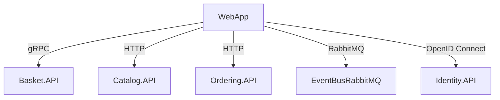

# eShop.WebApp – Architecture & Codebase Overview

## Title
**eShop.WebApp** – Modern Blazor web frontend for eShop microservices.

## Summary
- Implements the main web UI for eShop, built with Blazor Server and Razor Components.
- Integrates with Basket, Catalog, and Ordering microservices via HTTP, gRPC, and event bus.
- Features: product catalog, shopping cart, checkout, order history, authentication, and AI-powered chatbot.
- Uses distributed service defaults, OpenID Connect authentication, and RabbitMQ event bus.
- Highly modular, with clear separation of UI, services, and integration logic.

## Projects & Folder Map
| Folder/File | Purpose & Main Entry |
|-------------|---------------------|
| `Program.cs` | Main entry, minimal API setup, DI/service registration |
| `WebApp.csproj` | Project file, dependencies, references |
| `appsettings*.json` | Configuration sources |
| `Components/` | Razor UI components (pages, layout, chatbot, etc.) |
| `Services/` | Service layer for basket, ordering, product images, notifications |
| `Extensions/Extensions.cs` | DI/service registration, authentication, event bus wiring |
| `wwwroot/` | Static assets (CSS, images, icons) |

## Component Diagram


ASCII fallback:
WebApp --gRPC--> Basket.API
WebApp --HTTP--> Catalog.API
WebApp --HTTP--> Ordering.API
WebApp --RabbitMQ--> EventBusRabbitMQ
WebApp --OpenID Connect--> Identity.API

## Communication Channels
- **HTTP Endpoints:**
  - Minimal API endpoints in `Program.cs` (e.g., `app.MapDefaultEndpoints()`)
  - Razor page routes: `/`, `/cart`, `/checkout`, `/item/{itemId}`, `/user/orders`, `/user/login`, `/user/logout`
- **gRPC:**
  - Basket operations via `Basket.BasketClient` (see `Services/BasketService.cs`)
  - Proto: `../Basket.API/Proto/basket.proto`
- **Event Bus (RabbitMQ):**
  - Subscriptions for order status events (see `Extensions/Extensions.cs`)
  - Integration event handlers in `Services/OrderStatus/IntegrationEvents/EventHandling/`
- **OpenID Connect:**
  - Authentication via Identity.API (see `Extensions/Extensions.cs`)
- **AI Chatbot:**
  - ChatClient via OpenAI or Ollama (see `Components/Chatbot/`)

## Data Flow
### 1. Add Item to Basket
1. User browses catalog (`Components/Pages/Catalog/Catalog.razor`)
2. User views item (`Components/Pages/Item/ItemPage.razor`)
3. User submits add-to-cart form
4. `BasketState.AddAsync` called (see `Services/BasketState.cs`)
5. Basket updated via gRPC (`BasketService.UpdateBasketAsync`)
6. UI updates via state subscription

### 2. Place Order
1. User proceeds to checkout (`Components/Pages/Checkout/Checkout.razor`)
2. User submits checkout form
3. `BasketState.CheckoutAsync` called (see `Services/BasketState.cs`)
4. Order created via HTTP (`OrderingService.CreateOrder`)
5. Basket cleared
6. User redirected to order history (`Components/Pages/User/Orders.razor`)

## Dependency Registration & DI Wiring
- **DI Container:** ASP.NET Core built-in
- **Registration:**
  - `Extensions/Extensions.cs`:
    ```csharp
    builder.Services.AddScoped<BasketState>();
    builder.Services.AddSingleton<BasketService>();
    builder.Services.AddSingleton<OrderStatusNotificationService>();
    builder.Services.AddSingleton<IProductImageUrlProvider, ProductImageUrlProvider>();
    builder.Services.AddHttpClient<OrderingService>(...);
    builder.Services.AddGrpcClient<Basket.BasketClient>(...);
    builder.AddRabbitMqEventBus("EventBus").AddEventBusSubscriptions();
    builder.AddAuthenticationServices();
    ```
  - Authentication, event bus, and AI services registered via extension methods.

## Configuration & Secrets
- **Sources:**
  - `appsettings.json`, `appsettings.Development.json`
  - User secrets (`UserSecretsId` in `WebApp.csproj`)
- **Keys:**
  - `EventBus:SubscriptionClientName`, `SessionCookieLifetimeMinutes`, OpenID Connect URLs
- **Sensitive Data:**
  - OpenID Connect client secret, RabbitMQ credentials, and AI keys managed via environment variables or user secrets.

## Persistence & Data Access
- **No direct database access in WebApp.**
- **Basket:** via gRPC to Basket.API (Redis backend)
- **Catalog:** via HTTP to Catalog.API (SQL/EF Core backend)
- **Orders:** via HTTP to Ordering.API (SQL/EF Core backend)

## Patterns & Architecture Notes
- **Event-driven:** Order status updates via RabbitMQ integration events
- **Repository pattern:** Used in backend services (Basket.API, Catalog.API)
- **Minimal API:** Startup wiring in `Program.cs`
- **State management:** via `BasketState` and subscriptions
- **AI integration:** Chatbot leverages OpenAI/Ollama via DI
- **Authentication:** OpenID Connect, cookie auth, Blazor auth state provider

## Security & Operational Considerations
- **Authentication/Authorization:**
  - OpenID Connect via Identity.API
  - Cookie authentication, Blazor auth state
- **Observability:**
  - Logging via ASP.NET Core defaults
  - Event bus telemetry via RabbitMQTelemetry
- **Deployment:**
  - No Dockerfile in WebApp; orchestrated via AppHost or manifests
- **Risks:**
  - Ensure secrets (client secret, RabbitMQ credentials, AI keys) are not hard-coded
  - Use secure config and secret management for production

*This overview is based on the current codebase and folder structure. For further details, see referenced files and integration points.*


# UI Form Integration Guide

To add a new form and handler in WebApp (Blazor/Razor Components), follow this step-by-step pattern, as exemplified in `CartPage.razor`:

## 1. Define the Form in Razor Markup
- Use a `<form>` element with `method="post"` and `data-enhance` for enhanced Blazor form handling.
- Include an antiforgery token for security: `<AntiforgeryToken />`.
- Add hidden or visible input fields for form data.
- Example:
  ```razor
  <form method="post" data-enhance>
      <input type="hidden" name="_handler" value="update-cart" />
      <AntiforgeryToken />
      <input type="number" name="UpdateQuantityValue" value="@quantity" min="0" />
      <button type="submit" name="UpdateQuantityId" value="@item.ProductId">Update</button>
  </form>
  ```

## 2. Connect the Form to a Handler
- Add a form helper at the bottom of the component to wire the form to a handler method:
  ```razor
  <form @formname="update-cart" @onsubmit="@UpdateQuantityAsync"></form>
  ```

## 3. Bind Form Fields to Component Properties
- Use `[SupplyParameterFromForm]` on component properties to bind form field values:
  ```csharp
  [SupplyParameterFromForm]
  public int? UpdateQuantityId { get; set; }

  [SupplyParameterFromForm]
  public int? UpdateQuantityValue { get; set; }
  ```

## 4. Implement the Handler Method
- Create an async handler method matching the form's submit event:
  ```csharp
  private async Task UpdateQuantityAsync()
  {
      var id = UpdateQuantityId!.Value;
      var quantity = UpdateQuantityValue!.Value;
      await Basket.SetQuantityAsync(id, quantity);
      basketItems = await Basket.GetBasketItemsAsync();
  }
  ```

## 5. Update State and UI After Submission
- Refresh or update the relevant state and UI after the handler completes.
- Example: reload basket items, update totals, or trigger UI refresh.

## 6. Follow Naming and Binding Conventions
- Use clear, descriptive names for form fields and handler methods.
- Ensure form field names match the `[SupplyParameterFromForm]` properties.
- Place the form helper (`@formname`, `@onsubmit`) after the main markup for clarity.

---
**Reference:** See `CartPage.razor` for a complete working example of this pattern.
