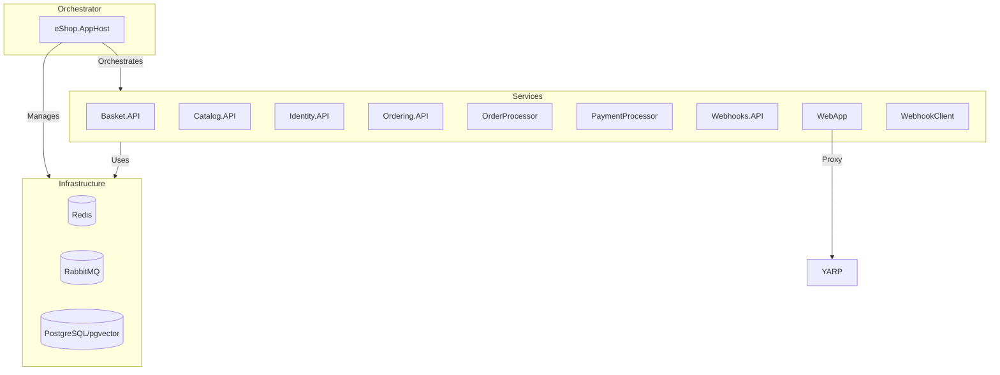

# eShop.AppHost – Distributed Application Orchestrator for eShop

## Summary
- Orchestrates all microservices, databases, and infrastructure for the eShop solution using .NET Aspire.
- Manages service lifecycles, dependencies, environment variables, and distributed configuration.
- Integrates Redis, RabbitMQ, PostgreSQL (with pgvector), and reverse proxies (YARP).
- Registers and wires up all main eShop services: Basket, Catalog, Identity, Ordering, Payment, Webhooks, WebApp, and supporting processors.
- Implements health checks, environment management, and supports AI/LLM integration (OpenAI, Ollama).

## Projects & Folder Map
| Folder/File                | Purpose & Main Entry Files                  |
|---------------------------|---------------------------------------------|
| `Program.cs`              | Main entry; orchestrates all services, infra, and dependencies |
| `Extensions.cs`           | Extension methods for Aspire builder (OpenAI, Ollama, YARP, headers) |
| `appsettings.json`        | Logging and connection string configuration |
| `eShop.AppHost.csproj`    | Project file; references all service projects and Aspire SDKs |
| `Properties/launchSettings.json` | Launch profiles and environment variables |

## Component Diagram


ASCII fallback:
AppHost --orchestrates--> [Basket.API, Catalog.API, Identity.API, Ordering.API, OrderProcessor, PaymentProcessor, Webhooks.API, WebApp, WebhooksClient]
AppHost --manages--> [Redis, RabbitMQ, PostgreSQL]
Services --use--> Infrastructure
WebApp --proxy--> YARP

## Communication Channels
- **HTTP Endpoints:**
  - All APIs expose HTTP endpoints, orchestrated via Aspire and YARP reverse proxy.
  - Example: `/api/catalog/items` (Catalog.API), `/api/orders` (Ordering.API)
- **gRPC:**
  - Basket.API exposes gRPC endpoints for basket operations.
- **Message Broker:**
  - RabbitMQ for integration events between services (EventBusRabbitMQ).
- **Database:**
  - PostgreSQL (pgvector) for Catalog, Identity, Ordering, Webhooks.
  - Redis for Basket persistence.
- **Reverse Proxy:**
  - YARP for mobile BFF and WebApp routing.

## Data Flow
### 1. Place Order
1. WebApp calls Ordering.API via HTTP (`WebApp/Program.cs`, `Ordering.API/Program.cs`)
2. Ordering.API validates and persists order (PostgreSQL)
3. Publishes integration event to RabbitMQ (`Ordering.API/appsettings.json`)
4. OrderProcessor/PaymentProcessor handle event, update status
5. Catalog.API checks/updates stock, publishes confirmation event

### 2. Add Item to Basket
1. WebApp calls Basket.API via gRPC (`WebApp/Program.cs`, `Basket.API/Program.cs`)
2. Basket.API updates basket in Redis
3. Publishes event to RabbitMQ if checkout
4. Ordering/API receives event, processes order

## Dependency Registration & DI Wiring
- **DI Container:** .NET Aspire distributed application builder
- **Service Registration:**
  - All services registered in `Program.cs` via `builder.AddProject<Projects.*>()`
  - Example:
    ```csharp
    var basketApi = builder.AddProject<Projects.Basket_API>("basket-api")
        .WithReference(redis)
        .WithReference(rabbitMq).WaitFor(rabbitMq)
        .WithEnvironment("Identity__Url", identityEndpoint);
    ```
- **Infrastructure Registration:**
  - Redis, RabbitMQ, PostgreSQL registered via Aspire hosting packages
  - Example:
    ```csharp
    var redis = builder.AddRedis("redis");
    var rabbitMq = builder.AddRabbitMQ("eventbus").WithLifetime(ContainerLifetime.Persistent);
    var postgres = builder.AddPostgres("postgres").WithImage("ankane/pgvector");
    ```
- **Extension Methods:**
  - Custom builder extensions in `Extensions.cs` for OpenAI, Ollama, YARP, headers

## Configuration & Secrets
- **Sources:**
  - `appsettings.json`, `appsettings.Development.json` in each service
  - Environment variables via Aspire orchestrator and launchSettings
  - UserSecrets for sensitive values (`UserSecretsId` in `.csproj`)
- **Keys:**
  - Connection strings for Redis, RabbitMQ, PostgreSQL
  - EventBus, Identity, OpenAI/Ollama endpoints
- **Secret Management:**
  - Recommend using environment variables, UserSecrets, or Key Vault for production

## Persistence & Data Access
- **Databases:**
  - PostgreSQL (pgvector) for Catalog, Identity, Ordering, Webhooks
  - Redis for Basket
- **ORMs:**
  - Entity Framework Core for SQL databases
- **Migrations:**
  - Located in each service's `Infrastructure/Migrations/` folder
- **Repository Pattern:**
  - Used in Basket.API, Catalog.API, Ordering.API

## Patterns & Architecture Notes
- **Event-driven:** Integration events via RabbitMQ/EventBus
- **Repository Pattern:** Encapsulates data access in services
- **Minimal API:** Used in service startup wiring
- **Separation of Concerns:** Each service has clear domain boundaries
- **ServiceDefaults:** Common health checks, telemetry, and service discovery via `eShop.ServiceDefaults`
- **Extensibility:** AI/LLM integration via OpenAI/Ollama builder extensions

## Security & Operational Considerations
- **Authentication/Authorization:**
  - JWT-based auth via Identity.API and `eShop.ServiceDefaults` (`AuthenticationExtensions.cs`)
  - Audience/issuer configured per service
- **Observability:**
  - OpenTelemetry for logging, metrics, tracing (`Extensions.cs`)
  - Health checks via `/health` and `/alive` endpoints
- **Deployment:**
  - Orchestrated via Aspire AppHost; launch profiles in `launchSettings.json`
  - No Dockerfiles in AppHost; container images managed via Aspire
- **Risks:**
  - Ensure secrets are not hard-coded; use secure config for connection strings
  - Health endpoints exposed only in development by default

---

*This overview documents the architecture and orchestration of the eShop.AppHost project. For service-specific details, see each referenced service's overview and configuration files.*
